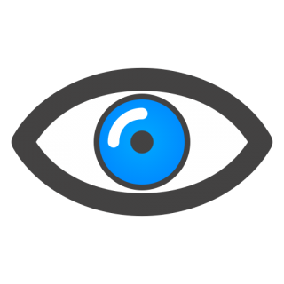

# Eyes
## Exercise on eyes

The project contains three files with code: "eyes.js", "styles.css" & "index.html"

The project shows a dynamic experience in the browser by picking up the movement of the mass. The eyeball moves to match the movement of the mass.
The mouse movement event is used to update the position of the "eye" elements displayed on the web page.
The mousemove is triggered when the mouse moves over an element.
It applies the following concepts: 
	1. Apply CSS styles to create web page layouts
	2. JavaScript to set web page styles
	3. Apply styles to HTML code

Future improvements: Adding additional face-like features such as a mouth and make it open/close as the mouse moves over it. 

